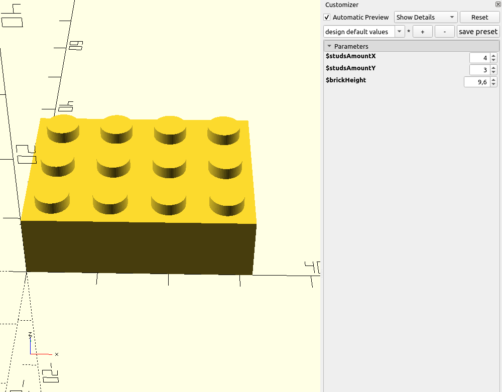
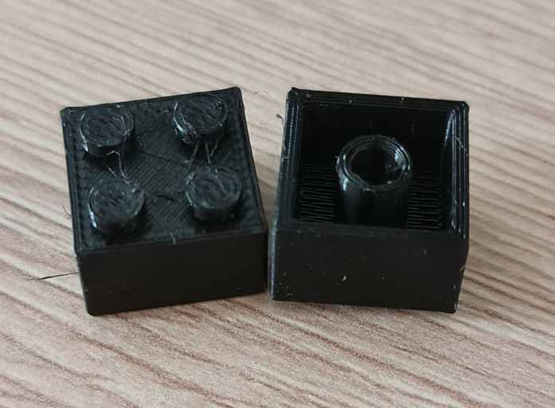
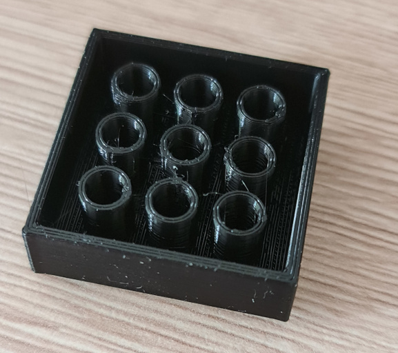

# Creating a brick model

You might be familiar with similar looking bricks which shall not be named in this documentation because I don't want
someone to take this down for ~~being butthurt~~ copyright infringement.

This is what it's gonna look like:


> I recommend reading the documentation on [creating shapes](creating-shapes.md) first

## Parameters

First we need to think about parameters. Width and height (in number of studs) is the first that comes to mind:

- `int $studsAmountX`
- `int $studsAmountY`

Some optional ones might include:

- `float $brickHeight`

So let's start!

## Creating the base shape

We're gonna start with a simple object where we add the `Renderable`, `HasWrappers` and `HasModuleDefinitions`
interfaces and use the `RenderableImplementation` trait to avoid writing boilerplate.

> More on modules later in this tutorial

```php
<?php

namespace Rikudou\PhpScad\Shape;

use Rikudou\PhpScad\Implementation\RenderableImplementation;
use Rikudou\PhpScad\Primitive\HasModuleDefinitions;
use Rikudou\PhpScad\Primitive\HasWrappers;
use Rikudou\PhpScad\Primitive\Renderable;

final class Brick implements Renderable, HasWrappers, HasModuleDefinitions
{
    use RenderableImplementation;

    public function render(): string
    {
        // TODO: Implement render() method.
    }
    
    public function getModules(): iterable
    {
        // TODO: Implement getModules() method.
    }
}
```

Now let's accept those parameters!

```php
<?php

namespace Rikudou\PhpScad\Shape;

use Rikudou\PhpScad\Implementation\RenderableImplementation;
use Rikudou\PhpScad\Implementation\ValueConverter;
use Rikudou\PhpScad\Primitive\HasModuleDefinitions;
use Rikudou\PhpScad\Primitive\HasWrappers;
use Rikudou\PhpScad\Primitive\Renderable;
use Rikudou\PhpScad\Value\IntValue;
use Rikudou\PhpScad\Value\NumericValue;
use Rikudou\PhpScad\Value\Reference;

final class Brick implements Renderable, HasWrappers, HasModuleDefinitions
{
    use RenderableImplementation;
    use ValueConverter;

    private IntValue|Reference $studsAmountX;
    private IntValue|Reference $studsAmountY;
    private NumericValue|Reference $brickHeight;

    public function __construct(
        IntValue|Reference|int $studsAmountX,
        IntValue|Reference|int $studsAmountY,
        NumericValue|Reference|float $brickHeight = 9.6,
    ) {
        $this->studsAmountX = $this->convertToValue($studsAmountX);
        $this->studsAmountY = $this->convertToValue($studsAmountY);
        $this->brickHeight = $this->convertToValue($brickHeight);
    }

    public function render(): string
    {
        // TODO: Implement render() method.
    }
    
    public function getModules(): iterable
    {
        // TODO: Implement getModules() method.
    }
}
```

What changed:

- `ValueConverter` trait was added to help with converting raw php types to `Value` objects
- the class now accepts the parameters mentioned on top of this readme
  - it accepts them either as php types (int, float) or `Value` types
  - for ease of use the values are converted to `Value` objects in the constructor
  - brick height has a default value

Now we're gonna define some parameters we'll need for the model:

```php
<?php

namespace Rikudou\PhpScad\Shape;

use Rikudou\PhpScad\Implementation\RenderableImplementation;
use Rikudou\PhpScad\Implementation\ValueConverter;
use Rikudou\PhpScad\Primitive\HasModuleDefinitions;
use Rikudou\PhpScad\Primitive\HasWrappers;
use Rikudou\PhpScad\Primitive\Renderable;
use Rikudou\PhpScad\Value\Expression;
use Rikudou\PhpScad\Value\FloatValue;
use Rikudou\PhpScad\Value\IntValue;
use Rikudou\PhpScad\Value\NumericValue;
use Rikudou\PhpScad\Value\Reference;

final class Brick implements Renderable, HasWrappers, HasModuleDefinitions
{
    use RenderableImplementation;
    use ValueConverter;

    private IntValue|Reference $studsAmountX;
    private IntValue|Reference $studsAmountY;
    private NumericValue|Reference $brickHeight;

    public function __construct(
        IntValue|Reference|int $studsAmountX,
        IntValue|Reference|int $studsAmountY,
        NumericValue|Reference|float $brickHeight = 9.6,
    ) {
        $this->studsAmountX = $this->convertToValue($studsAmountX);
        $this->studsAmountY = $this->convertToValue($studsAmountY);
        $this->brickHeight = $this->convertToValue($brickHeight);
    }

    public function render(): string
    {
        // all units are in millimeters

        // let's add some small tolerance, printed objects are rarely the exact dimensions you set them as
        $tolerance = 0.1;
        $tolerances = 2 * $tolerance;
        // the width and depth of one single stud base
        $studBaseSize = 8;
        // the height of the stud cylinder
        $studHeight = 1.8;
        // the radius of the cylinder
        $studRadius = 2.4;
        $wallThickness = 1.5;
        $bottomCylinderWallThickness = 1;
        $topWallThickness = 1.5;
        $bottomCylinderRadius = 3.26;

        // let's calculate the final width and depth
        $width = $this->studsAmountX instanceof Reference
            ? new Expression("{$studBaseSize} * {$this->studsAmountX} - {$tolerances}")
            : new FloatValue($studBaseSize * $this->studsAmountX->getValue() - $tolerances);
        $depth = $this->studsAmountY instanceof Reference
            ? new Expression("{$studBaseSize} * {$this->studsAmountY} - {$tolerances}")
            : new FloatValue($studBaseSize * $this->studsAmountY->getValue() - $tolerances);
    }
    
    public function getModules(): iterable
    {
        // TODO: Implement getModules() method.
    }
}
```

We've added some variables we'll need in our calculations.
We also calculated the final width and depth of the brick based on input parameters.

As mentioned in previous tutorial, we're checking whether the values are literals,
in which case the value is calculated directly in php, or a reference in which case we use an expression and the value
will be calculated by OpenSCAD at runtime.

> We could have used `Expression` straight away without doing a check first, but you would end up with something like
> "8 * 2 - 0.2" in the resulting OpenSCAD code which I personally don't like

Now one final touch, before we get to creating our shapes: we will not be providing the render string directly but rather as an
alias to existing PHP renderables:

```php
<?php

namespace Rikudou\PhpScad\Shape;

use Rikudou\PhpScad\Implementation\AliasShape;
use Rikudou\PhpScad\Implementation\ValueConverter;
use Rikudou\PhpScad\Primitive\HasModuleDefinitions;
use Rikudou\PhpScad\Primitive\HasWrappers;
use Rikudou\PhpScad\Primitive\Renderable;
use Rikudou\PhpScad\Value\Expression;
use Rikudou\PhpScad\Value\FloatValue;
use Rikudou\PhpScad\Value\IntValue;
use Rikudou\PhpScad\Value\NumericValue;
use Rikudou\PhpScad\Value\Reference;

final class Brick implements Renderable, HasWrappers, HasModuleDefinitions
{
    use ValueConverter;
    use AliasShape;

    private IntValue|Reference $studsAmountX;
    private IntValue|Reference $studsAmountY;
    private NumericValue|Reference $brickHeight;

    public function __construct(
        IntValue|Reference|int $studsAmountX,
        IntValue|Reference|int $studsAmountY,
        NumericValue|Reference|float $brickHeight = 9.6,
    ) {
        $this->studsAmountX = $this->convertToValue($studsAmountX);
        $this->studsAmountY = $this->convertToValue($studsAmountY);
        $this->brickHeight = $this->convertToValue($brickHeight);
    }

    protected function getAliasedShape(): Renderable
    {
        // all units are in millimeters

        // let's add some small tolerance, printed objects are rarely the exact dimensions you set them as
        $tolerance = 0.1;
        $tolerances = 2 * $tolerance;
        // the width and depth of one single stud base
        $studBaseSize = 8;
        // the height of the stud cylinder
        $studHeight = 1.8;
        // the radius of the cylinder
        $studRadius = 2.4;
        $wallThickness = 1.5;
        $bottomCylinderWallThickness = 1;
        $topWallThickness = 1.5;
        $bottomCylinderRadius = 3.26;

        // let's calculate the final width and depth
        $width = $this->studsAmountX instanceof Reference
            ? new Expression("{$studBaseSize} * {$this->studsAmountX} - {$tolerances}")
            : new FloatValue($studBaseSize * $this->studsAmountX->getValue() - $tolerances);
        $depth = $this->studsAmountY instanceof Reference
            ? new Expression("{$studBaseSize} * {$this->studsAmountY} - {$tolerances}")
            : new FloatValue($studBaseSize * $this->studsAmountY->getValue() - $tolerances);
    }
}
```

What's changed?

- `RenderableImplementation` trait was replaced with `AliasShape`
- `render()` method was replaced with `getAliasedShape()`
- `getModules()` was removed and the default implementation from `AliasShape` is used

> This change allows us to work with high level `Renderable` php objects instead of writing the OpenSCAD string directly.

Let's start creating some shapes!

```php
$brick = new Cube(
    width: $width,
    depth: $depth,
    height: $this->brickHeight,
);
```


This is the basic cube with the correct size, but that's it. For ease of calculating, let's center it a bit!

```php
$brick = (new Cube(
    width: $width,
    depth: $depth,
    height: $this->brickHeight,
))->movedLeft(
    $width instanceof Reference
        ? new Expression("{$width} / 2")
        : new FloatValue($width->getValue() / 2)
)->movedDown(
    $depth instanceof Reference
        ? new Expression("{$depth} / 2")
        : new FloatValue($depth->getValue() / 2)
);
```

We moved it left by half its width and down by half its depth, which means we centered it on the X and Y axes.


Now let's make it hollow. To do that, we need to do a difference between the cube we created and another, smaller cube,
centered inside the larger one.

```php
$innerCutWidth = $width instanceof Reference
    ? new Expression("{$width} - {$tolerances} - 2 * {$wallThickness}")
    : new FloatValue($width->getValue() - $tolerances - 2 * $wallThickness);
$innerCutDepth = $depth instanceof Reference
    ? new Expression("{$depth} - {$tolerances} - 2 * {$wallThickness}")
    : new FloatValue($depth->getValue() - $tolerances - 2 * $wallThickness);
$innerCutHeight = $this->brickHeight instanceof Reference
    ? new Expression("{$this->brickHeight} - {$topWallThickness}")
    : new FloatValue($this->brickHeight->getValue() - $topWallThickness);
$innerCut = (new Cube(
    width: $innerCutWidth,
    depth: $innerCutDepth,
    height: $innerCutHeight,
));
```

The width and depth use the same algorithm: take the whole width,
subtract the tolerances we defined earlier and subtract the thickness of the wall (twice).
By doing that you effectively create the walls when you center the inner cube inside the outside cube.
The height uses the same principle, except we use the top wall thickness.

Centering the inner cube uses the same principle as centering the outer one:

```php
$innerCut = (new Cube(
    width: $innerCutWidth,
    depth: $innerCutDepth,
    height: $innerCutHeight,
))->movedLeft(
    $innerCutWidth instanceof Reference
        ? new Expression("{$innerCutWidth} / 2")
        : new FloatValue($innerCutWidth->getValue() / 2)
)->movedDown(
    $innerCutDepth instanceof Reference
        ? new Expression("{$innerCutDepth} / 2")
        : new FloatValue($innerCutDepth->getValue() / 2)
)->movedDownOnZ(0.01);
```

> We also moved it down on Z axis by 0.01 mm, this was already explained in the previous tutorial - both inner and 
> outer cube would sit on the same Z dimension (exactly 0) which can cause issues with rendering.
> Now the outer cube sits on Z 0, while inner cube sits on Z -0.01.
> This change is indistinguishable for a human eye (or a hobby-grade 3D printer).

Subtracting the cubes is really easy:

```php
$brick = $brick->subtractedWith($innerCut);
```

And now we have this:


Good progress so far, let's check the whole code:

```php
<?php

namespace Rikudou\PhpScad\Shape;

use Rikudou\PhpScad\Implementation\AliasShape;
use Rikudou\PhpScad\Implementation\ValueConverter;
use Rikudou\PhpScad\Primitive\HasModuleDefinitions;
use Rikudou\PhpScad\Primitive\HasWrappers;
use Rikudou\PhpScad\Primitive\Renderable;
use Rikudou\PhpScad\Value\Expression;
use Rikudou\PhpScad\Value\FloatValue;
use Rikudou\PhpScad\Value\IntValue;
use Rikudou\PhpScad\Value\NumericValue;
use Rikudou\PhpScad\Value\Reference;

final class Brick implements Renderable, HasWrappers, HasModuleDefinitions
{
    use ValueConverter;
    use AliasShape;

    private IntValue|Reference $studsAmountX;
    private IntValue|Reference $studsAmountY;
    private NumericValue|Reference $brickHeight;

    public function __construct(
        IntValue|Reference|int $studsAmountX,
        IntValue|Reference|int $studsAmountY,
        NumericValue|Reference|float $brickHeight = 9.6,
    ) {
        $this->studsAmountX = $this->convertToValue($studsAmountX);
        $this->studsAmountY = $this->convertToValue($studsAmountY);
        $this->brickHeight = $this->convertToValue($brickHeight);
    }

    protected function getAliasedShape(): Renderable
    {
        // all units are in millimeters

        // let's add some small tolerance, printed objects are rarely the exact dimensions you set them as
        $tolerance = 0.1;
        $tolerances = 2 * $tolerance;
        // the width and depth of one single stud base
        $studBaseSize = 8;
        // the height of the stud cylinder
        $studHeight = 1.8;
        // the radius of the cylinder
        $studRadius = 2.4;
        $wallThickness = 1.5;
        $bottomCylinderWallThickness = 1;
        $topWallThickness = 1.5;
        $bottomCylinderRadius = 3.26;

        // let's calculate the final width and depth
        $width = $this->studsAmountX instanceof Reference
            ? new Expression("{$studBaseSize} * {$this->studsAmountX} - {$tolerances}")
            : new FloatValue($studBaseSize * $this->studsAmountX->getValue() - $tolerances);
        $depth = $this->studsAmountY instanceof Reference
            ? new Expression("{$studBaseSize} * {$this->studsAmountY} - {$tolerances}")
            : new FloatValue($studBaseSize * $this->studsAmountY->getValue() - $tolerances);

        $brick = (new Cube(
            width: $width,
            depth: $depth,
            height: $this->brickHeight,
        ))->movedLeft(
            $width instanceof Reference
                ? new Expression("{$width} / 2")
                : new FloatValue($width->getValue() / 2)
        )->movedDown(
            $depth instanceof Reference
                ? new Expression("{$depth} / 2")
                : new FloatValue($depth->getValue() / 2)
        );

        $innerCutWidth = $width instanceof Reference
            ? new Expression("{$width} - {$tolerances} - 2 * {$wallThickness}")
            : new FloatValue($width->getValue() - $tolerances - 2 * $wallThickness);
        $innerCutDepth = $depth instanceof Reference
            ? new Expression("{$depth} - {$tolerances} - 2 * {$wallThickness}")
            : new FloatValue($depth->getValue() - $tolerances - 2 * $wallThickness);
        $innerCutHeight = $this->brickHeight instanceof Reference
            ? new Expression("{$this->brickHeight} - {$topWallThickness}")
            : new FloatValue($this->brickHeight->getValue() - $topWallThickness);
        $innerCut = (new Cube(
            width: $innerCutWidth,
            depth: $innerCutDepth,
            height: $innerCutHeight,
        ))->movedLeft(
            $innerCutWidth instanceof Reference
                ? new Expression("{$innerCutWidth} / 2")
                : new FloatValue($innerCutWidth->getValue() / 2)
        )->movedDown(
            $innerCutDepth instanceof Reference
                ? new Expression("{$innerCutDepth} / 2")
                : new FloatValue($innerCutDepth->getValue() / 2)
        )->movedDownOnZ(0.01);

        $brick = $brick->subtractedWith($innerCut);

        return $brick;
    }
}
```

## Creating the studs

Let's create the cylinders on top of the bricks! I'll be moving the code for the studs to its own method, so we
need to move some variables to instance properties:

```php
final class Brick implements Renderable, HasWrappers, HasModuleDefinitions
{
    use ValueConverter;
    use AliasShape;

    private IntValue|Reference $studsAmountX;
    private IntValue|Reference $studsAmountY;
    private NumericValue|Reference $brickHeight;

    private int $studBaseSize = 8;
    private float $studHeight = 1.8;
    private float $studRadius = 2.4;
    private float $topWallThickness = 1.5;

    private function createStudCylinder(): Cylinder
    {
        return new Cylinder(
            height: $this->studHeight,
            radius: $this->studRadius,
        );
    }

    // ...
}
```

Now it gets a little tougher — because we're supporting runtime references, we'll have to embed a little bit of OpenSCAD
code directly.
Again we'll have different implementations for literal values and references, this time to show the difference between
the two approaches.

### Literals

When using literals, it's fairly easy, you just iterate over all the values and create a cylinder at the spot:

```php
$studs = [];
for ($x = 1; $x <= $this->studsAmountX->getValue(); ++$x) {
    for ($y = 1; $y <= $this->studsAmountY->getValue(); ++$y) {
        $stud = $this->createStudCylinder()
            ->movedLeft($x * $this->studBaseSize)
            ->movedUp($y * $this->studBaseSize);
        $studs[] = $stud;
    }
}
$studs = new RenderableContainer(...$studs);
```

Note the use of `RenderableContainer` - it's a simple class that allows us to wrap multiple renderables in a single
renderable, meaning you can, for example, move all the renderables by using a single instruction instead of moving
all the renderables on their own.

The for loop is simple — iterate over the width and depth of the whole brick and create a stud at every `$studBaseSize`.

Now let's move it to the correct position:

```php
$studs = $studs
    ->movedLeft(($this->studsAmountX->getValue() + 1) * $this->studBaseSize / 2)
    ->movedDown(($this->studsAmountY->getValue() + 1) * $this->studBaseSize / 2)
    ->movedUpOnZ($this->brickHeight)
;
```

And voilà, this is what we've got:


### References

To make this work with references, we need to embed the for loop directly into the OpenSCAD code because we cannot
iterate over something we don't have a concrete value for yet.

We will use `RenderableExpression` for that:

```php
$studs = new RenderableExpression(
"for (x = [1 : {$this->studsAmountX}], y = [1 : {$this->studsAmountY}]) {
     translate([x * {$this->studBaseSize}, y * {$this->studBaseSize}, 0]) {
         {$this->createStudCylinder()->render()}
     }
}"
);
```

You need to know a bit of OpenSCAD syntax for that, but the for loop seems simple enough - instead of in php
we embed the for loop directly in the OpenSCAD code and we can make use of the php variables like `$studsAmountX`, `$studsAmountY`,
`$studBaseSize` and we can even directly render a `Renderable` inside the code by calling its `render()` method.

Sadly we're not done here, if we ran the code now we would get this error in OpenSCAD:
`WARNING: Ignoring unknown module 'PhpScad_NonCenterableCylinder'`.

### Modules

Modules in OpenSCAD are basically functions that create a 3D object in the view.
PhpScad has support for modules and most of the time it's seamless — every Renderable can provide a list of modules 
it uses and those modules are embedded in the OpenSCAD file.

That's why we had no problem when we were using the for loop in php — we were returning a `RenderableContainer`,
which in turn contains `Cylinder` objects which declare that they're using the `NonCenterableCylinderModule` module
(which is called `PhpScad_NonCenterableCylinder` when exported to OpenSCAD).

But if we're using a `RenderableExpression`, there's no way to automatically check what's inside, so we need to provide
the information on modules manually as a second parameter:

```php
$studs = new RenderableExpression(
       "for (x = [1 : {$this->studsAmountX}], y = [1 : {$this->studsAmountY}]) {
            translate([x * {$this->studBaseSize}, y * {$this->studBaseSize}, 0]) {
                {$this->createStudCylinder()->render()}
            }
       }",
      [
          new NonCenterableCylinderModule(),
      ]
  );
```

Now we need to move it to the correct position as well:

```php
$studs = $studs
    ->movedLeft(new Expression("({$this->studsAmountX} + 1) * {$this->studBaseSize} / 2"))
    ->movedDown(new Expression("({$this->studsAmountY} + 1) * {$this->studBaseSize} / 2"))
    ->movedUpOnZ($this->brickHeight)
;
```

This is what this part looks like whole:

```php
if ($this->studsAmountX instanceof Reference || $this->studsAmountY instanceof Reference) {
    $studs = new RenderableExpression(
        "for (x = [1 : {$this->studsAmountX}], y = [1 : {$this->studsAmountY}]) {
             translate([x * {$this->studBaseSize}, y * {$this->studBaseSize}, 0]) {
                 {$this->createStudCylinder()->render()}
             }
        }",
        [
            new NonCenterableCylinderModule(),
        ],
    );
    $studs = $studs
        ->movedLeft(new Expression("({$this->studsAmountX} + 1) * {$this->studBaseSize} / 2"))
        ->movedDown(new Expression("({$this->studsAmountY} + 1) * {$this->studBaseSize} / 2"))
        ->movedUpOnZ($this->brickHeight)
    ;
} else {
    $studs = [];
    for ($x = 1; $x <= $this->studsAmountX->getValue(); ++$x) {
        for ($y = 1; $y <= $this->studsAmountY->getValue(); ++$y) {
            $stud = $this->createStudCylinder()
                ->movedRight($x * $this->studBaseSize)
                ->movedUp($y * $this->studBaseSize);
            $studs[] = $stud;
        }
    }
    $studs = new RenderableContainer(...$studs);
    $studs = $studs
        ->movedLeft(($this->studsAmountX->getValue() + 1) * $this->studBaseSize / 2)
        ->movedDown(($this->studsAmountY->getValue() + 1) * $this->studBaseSize / 2)
        ->movedUpOnZ($this->brickHeight)
    ;
}
```

Two parts of the brick are done, now onto the last part! But first let's check what the whole class looks like now:

```php
<?php

namespace Rikudou\PhpScad\Shape;

use Rikudou\PhpScad\Combination\RenderableContainer;
use Rikudou\PhpScad\Implementation\AliasShape;
use Rikudou\PhpScad\Implementation\ValueConverter;
use Rikudou\PhpScad\Module\NonCenterableCylinderModule;
use Rikudou\PhpScad\Primitive\HasModuleDefinitions;
use Rikudou\PhpScad\Primitive\HasWrappers;
use Rikudou\PhpScad\Primitive\Renderable;
use Rikudou\PhpScad\Statement\RenderableExpression;
use Rikudou\PhpScad\Value\Expression;
use Rikudou\PhpScad\Value\FloatValue;
use Rikudou\PhpScad\Value\IntValue;
use Rikudou\PhpScad\Value\NumericValue;
use Rikudou\PhpScad\Value\Reference;

final class Brick implements Renderable, HasWrappers, HasModuleDefinitions
{
    use ValueConverter;
    use AliasShape;

    private IntValue|Reference $studsAmountX;
    private IntValue|Reference $studsAmountY;
    private NumericValue|Reference $brickHeight;

    private int $studBaseSize = 8;
    private float $studHeight = 1.8;
    private float $studRadius = 2.4;

    public function __construct(
        IntValue|Reference|int $studsAmountX,
        IntValue|Reference|int $studsAmountY,
        NumericValue|Reference|float $brickHeight = 9.6,
    ) {
        $this->studsAmountX = $this->convertToValue($studsAmountX);
        $this->studsAmountY = $this->convertToValue($studsAmountY);
        $this->brickHeight = $this->convertToValue($brickHeight);
    }

    protected function getAliasedShape(): Renderable
    {
        // all units are in millimeters

        // let's add some small tolerance, printed objects are rarely the exact dimensions you set them as
        $tolerance = 0.1;
        $tolerances = 2 * $tolerance;
        $wallThickness = 1.5;
        $bottomCylinderWallThickness = 1;
        $topWallThickness = 1.5;
        $bottomCylinderRadius = 3.26;

        // let's calculate the final width and depth
        $width = $this->studsAmountX instanceof Reference
            ? new Expression("{$this->studBaseSize} * {$this->studsAmountX} - {$tolerances}")
            : new FloatValue($this->studBaseSize * $this->studsAmountX->getValue() - $tolerances);
        $depth = $this->studsAmountY instanceof Reference
            ? new Expression("{$this->studBaseSize} * {$this->studsAmountY} - {$tolerances}")
            : new FloatValue($this->studBaseSize * $this->studsAmountY->getValue() - $tolerances);

        $brick = (new Cube(
            width: $width,
            depth: $depth,
            height: $this->brickHeight,
        ))->movedLeft(
            $width instanceof Reference
                ? new Expression("{$width} / 2")
                : new FloatValue($width->getValue() / 2)
        )->movedDown(
            $depth instanceof Reference
                ? new Expression("{$depth} / 2")
                : new FloatValue($depth->getValue() / 2)
        );

        $innerCutWidth = $width instanceof Reference
            ? new Expression("{$width} - {$tolerances} - 2 * {$wallThickness}")
            : new FloatValue($width->getValue() - $tolerances - 2 * $wallThickness);
        $innerCutDepth = $depth instanceof Reference
            ? new Expression("{$depth} - {$tolerances} - 2 * {$wallThickness}")
            : new FloatValue($depth->getValue() - $tolerances - 2 * $wallThickness);
        $innerCutHeight = $this->brickHeight instanceof Reference
            ? new Expression("{$this->brickHeight} - {$topWallThickness}")
            : new FloatValue($this->brickHeight->getValue() - $topWallThickness);
        $innerCut = (new Cube(
            width: $innerCutWidth,
            depth: $innerCutDepth,
            height: $innerCutHeight,
        ))->movedLeft(
            $innerCutWidth instanceof Reference
                ? new Expression("{$innerCutWidth} / 2")
                : new FloatValue($innerCutWidth->getValue() / 2)
        )->movedDown(
            $innerCutDepth instanceof Reference
                ? new Expression("{$innerCutDepth} / 2")
                : new FloatValue($innerCutDepth->getValue() / 2)
        )->movedDownOnZ(0.01);

        $brick = $brick->subtractedWith($innerCut);

        if ($this->studsAmountX instanceof Reference || $this->studsAmountY instanceof Reference) {
            $studs = new RenderableExpression(
            "for (x = [1 : {$this->studsAmountX}], y = [1 : {$this->studsAmountY}]) {
                           translate([x * {$this->studBaseSize}, y * {$this->studBaseSize}, 0]) {
                               {$this->createStudCylinder()->render()}
                           }
                      }",
                [
                    new NonCenterableCylinderModule(),
                ],
            );
            $studs = $studs
                ->movedLeft(new Expression("({$this->studsAmountX} + 1) * {$this->studBaseSize} / 2"))
                ->movedDown(new Expression("({$this->studsAmountY} + 1) * {$this->studBaseSize} / 2"))
                ->movedUpOnZ($this->brickHeight)
            ;
        } else {
            $studs = [];
            for ($x = 1; $x <= $this->studsAmountX->getValue(); ++$x) {
                for ($y = 1; $y <= $this->studsAmountY->getValue(); ++$y) {
                    $stud = $this->createStudCylinder()
                        ->movedRight($x * $this->studBaseSize)
                        ->movedUp($y * $this->studBaseSize);
                    $studs[] = $stud;
                }
            }
            $studs = new RenderableContainer(...$studs);
            $studs = $studs
                ->movedLeft(($this->studsAmountX->getValue() + 1) * $this->studBaseSize / 2)
                ->movedDown(($this->studsAmountY->getValue() + 1) * $this->studBaseSize / 2)
                ->movedUpOnZ($this->brickHeight)
            ;
        }

        return new RenderableContainer($brick, $studs);
    }

    private function createStudCylinder(): Cylinder
    {
        return new Cylinder(
            height: $this->studHeight,
            radius: $this->studRadius,
        );
    }
}
```
## Bottom cylinder

The bricks this one is inspired from have a cylinder at the bottom. And at least in 3D printing it has an important
role — it supports the parts that are above it.
Bridging over thin air only gets so far, while it might work very well for the 2x2 brick I've been showing in examples,
some 20x20 brick wouldn't bridge good without supports at all.

This is what our brick looks like on the bottom right now:


We'll move two of the variables to properties as well
because we'll be providing a new method that creates the bottom cylinder:

```php
final class Brick implements Renderable, HasWrappers, HasModuleDefinitions
{
    // ...
    private float $bottomCylinderRadius = 3.26;
    private float $bottomCylinderWallThickness = 1;
    // ...
    
    private function createBottomCylinder(): Difference
    {
        $cylinder = new Cylinder(height: $this->brickHeight, radius: $this->bottomCylinderRadius);
        $innerCylinder = (new Cylinder(height: $this->brickHeight, radius: $this->bottomCylinderRadius - $this->bottomCylinderWallThickness))
            ->movedDownOnZ(0.01);

        return $cylinder->subtractedWith($innerCylinder);
    }
}
```

The `createBottomCylinder()` doesn't do anything we haven't seen before, but let's reiterate anyway:

- create an outer cylinder with the defined radius, the height can be the same as the brick's height because
it will simply interject and be invisible, no need to subtract the top wall size
- create an inner cylinder that will be subtracted from the outer one, it has the radius of the outer cylinder minus
the bottom cylinder thickness — when centered in the outer cylinder, it will create the desired wall, it's also moved
down on Z axis by 0.01 to prevent flickering and wrong rendering
- we return the difference between the two objects using the helper method `subtractedWith()`

Here comes another for loop to generate the correct number of cylinders on the correct positions:

```php
if ($this->studsAmountX instanceof Reference || $this->studsAmountY instanceof Reference) {
    $bottomCylinders = new RenderableExpression(
          "for (x = [1 : {$this->studsAmountX} - 1], y = [1 : {$this->studsAmountY} - 1]) {
              translate([x * {$this->studBaseSize}, y * {$this->studBaseSize}, 0]) {
                  {$this->createBottomCylinder()->render()}
              }
          }"
    );
    $bottomCylinders = $bottomCylinders
        ->movedLeft(new Expression("{$this->studsAmountX} * {$this->studBaseSize} / 2"))
        ->movedDown(new Expression("{$this->studsAmountY} * {$this->studBaseSize} / 2"))
    ;
} else {
    $bottomCylinders = [];
    for ($x = 1; $x < $this->studsAmountX->getValue(); ++$x) {
        for ($y = 1; $y < $this->studsAmountY->getValue(); ++$y) {
            $bottomCylinders[] = $this->createBottomCylinder()
                ->movedRight($x * $this->studBaseSize)
                ->movedUp($y * $this->studBaseSize)
            ;
        }
    }
    $bottomCylinders = new RenderableContainer(...$bottomCylinders);
    $bottomCylinders = $bottomCylinders
        ->movedLeft($this->studsAmountX->getValue() * $this->studBaseSize / 2)
        ->movedDown($this->studsAmountY->getValue() * $this->studBaseSize / 2)
    ;
}
```

Again we're doing the same loop twice, once in php and once in OpenSCAD, to support both literals and references 
(we could get by with using only the `RenderableExpression` for both, but what fun would that be?)

This is what it looks like now:


Or slightly larger (4x4):


And we're almost done here! This is what we have:

```php
<?php

namespace Rikudou\PhpScad\Shape;

use Rikudou\PhpScad\Combination\Difference;
use Rikudou\PhpScad\Combination\RenderableContainer;
use Rikudou\PhpScad\Implementation\AliasShape;
use Rikudou\PhpScad\Implementation\ValueConverter;
use Rikudou\PhpScad\Module\NonCenterableCylinderModule;
use Rikudou\PhpScad\Primitive\HasModuleDefinitions;
use Rikudou\PhpScad\Primitive\HasWrappers;
use Rikudou\PhpScad\Primitive\Renderable;
use Rikudou\PhpScad\Statement\RenderableExpression;
use Rikudou\PhpScad\Value\Expression;
use Rikudou\PhpScad\Value\FloatValue;
use Rikudou\PhpScad\Value\IntValue;
use Rikudou\PhpScad\Value\NumericValue;
use Rikudou\PhpScad\Value\Reference;

final class Brick implements Renderable, HasWrappers, HasModuleDefinitions
{
    use ValueConverter;
    use AliasShape;

    private IntValue|Reference $studsAmountX;
    private IntValue|Reference $studsAmountY;
    private NumericValue|Reference $brickHeight;

    private int $studBaseSize = 8;
    private float $studHeight = 1.8;
    private float $studRadius = 2.4;
    private float $bottomCylinderRadius = 3.26;
    private float $bottomCylinderWallThickness = 1;

    public function __construct(
        IntValue|Reference|int $studsAmountX,
        IntValue|Reference|int $studsAmountY,
        NumericValue|Reference|float $brickHeight = 9.6,
    ) {
        $this->studsAmountX = $this->convertToValue($studsAmountX);
        $this->studsAmountY = $this->convertToValue($studsAmountY);
        $this->brickHeight = $this->convertToValue($brickHeight);
    }

    protected function getAliasedShape(): Renderable
    {
        // all units are in millimeters

        // let's add some small tolerance, printed objects are rarely the exact dimensions you set them as
        $tolerance = 0.1;
        $tolerances = 2 * $tolerance;
        $wallThickness = 1.5;
        $topWallThickness = 1.5;

        // let's calculate the final width and depth
        $width = $this->studsAmountX instanceof Reference
            ? new Expression("{$this->studBaseSize} * {$this->studsAmountX} - {$tolerances}")
            : new FloatValue($this->studBaseSize * $this->studsAmountX->getValue() - $tolerances);
        $depth = $this->studsAmountY instanceof Reference
            ? new Expression("{$this->studBaseSize} * {$this->studsAmountY} - {$tolerances}")
            : new FloatValue($this->studBaseSize * $this->studsAmountY->getValue() - $tolerances);

        $brick = (new Cube(
            width: $width,
            depth: $depth,
            height: $this->brickHeight,
        ))->movedLeft(
            $width instanceof Reference
                ? new Expression("{$width} / 2")
                : new FloatValue($width->getValue() / 2)
        )->movedDown(
            $depth instanceof Reference
                ? new Expression("{$depth} / 2")
                : new FloatValue($depth->getValue() / 2)
        );

        $innerCutWidth = $width instanceof Reference
            ? new Expression("{$width} - {$tolerances} - 2 * {$wallThickness}")
            : new FloatValue($width->getValue() - $tolerances - 2 * $wallThickness);
        $innerCutDepth = $depth instanceof Reference
            ? new Expression("{$depth} - {$tolerances} - 2 * {$wallThickness}")
            : new FloatValue($depth->getValue() - $tolerances - 2 * $wallThickness);
        $innerCutHeight = $this->brickHeight instanceof Reference
            ? new Expression("{$this->brickHeight} - {$topWallThickness}")
            : new FloatValue($this->brickHeight->getValue() - $topWallThickness);
        $innerCut = (new Cube(
            width: $innerCutWidth,
            depth: $innerCutDepth,
            height: $innerCutHeight,
        ))->movedLeft(
            $innerCutWidth instanceof Reference
                ? new Expression("{$innerCutWidth} / 2")
                : new FloatValue($innerCutWidth->getValue() / 2)
        )->movedDown(
            $innerCutDepth instanceof Reference
                ? new Expression("{$innerCutDepth} / 2")
                : new FloatValue($innerCutDepth->getValue() / 2)
        )->movedDownOnZ(0.01);

        $brick = $brick->subtractedWith($innerCut);

        if ($this->studsAmountX instanceof Reference || $this->studsAmountY instanceof Reference) {
            $studs = new RenderableExpression(
            "for (x = [1 : {$this->studsAmountX}], y = [1 : {$this->studsAmountY}]) {
                           translate([x * {$this->studBaseSize}, y * {$this->studBaseSize}, 0]) {
                               {$this->createStudCylinder()->render()}
                           }
                      }",
                [
                    new NonCenterableCylinderModule(),
                ],
            );
            $studs = $studs
                ->movedLeft(new Expression("({$this->studsAmountX} + 1) * {$this->studBaseSize} / 2"))
                ->movedDown(new Expression("({$this->studsAmountY} + 1) * {$this->studBaseSize} / 2"))
                ->movedUpOnZ($this->brickHeight)
            ;
        } else {
            $studs = [];
            for ($x = 1; $x <= $this->studsAmountX->getValue(); ++$x) {
                for ($y = 1; $y <= $this->studsAmountY->getValue(); ++$y) {
                    $stud = $this->createStudCylinder()
                        ->movedRight($x * $this->studBaseSize)
                        ->movedUp($y * $this->studBaseSize);
                    $studs[] = $stud;
                }
            }
            $studs = new RenderableContainer(...$studs);
            $studs = $studs
                ->movedLeft(($this->studsAmountX->getValue() + 1) * $this->studBaseSize / 2)
                ->movedDown(($this->studsAmountY->getValue() + 1) * $this->studBaseSize / 2)
                ->movedUpOnZ($this->brickHeight)
            ;
        }

        if ($this->studsAmountX instanceof Reference || $this->studsAmountY instanceof Reference) {
            $bottomCylinders = new RenderableExpression(
                  "for (x = [1 : {$this->studsAmountX} - 1], y = [1 : {$this->studsAmountY} - 1]) {
                                translate([x * {$this->studBaseSize}, y * {$this->studBaseSize}, 0]) {
                                    {$this->createBottomCylinder()->render()}
                                }
                            }"
            );
            $bottomCylinders = $bottomCylinders
                ->movedLeft(new Expression("{$this->studsAmountX} * {$this->studBaseSize} / 2"))
                ->movedDown(new Expression("{$this->studsAmountY} * {$this->studBaseSize} / 2"))
            ;
        } else {
            $bottomCylinders = [];
            for ($x = 1; $x < $this->studsAmountX->getValue(); ++$x) {
                for ($y = 1; $y < $this->studsAmountY->getValue(); ++$y) {
                    $bottomCylinders[] = $this->createBottomCylinder()
                        ->movedRight($x * $this->studBaseSize)
                        ->movedUp($y * $this->studBaseSize)
                    ;
                }
            }
            $bottomCylinders = new RenderableContainer(...$bottomCylinders);
            $bottomCylinders = $bottomCylinders
                ->movedLeft($this->studsAmountX->getValue() * $this->studBaseSize / 2)
                ->movedDown($this->studsAmountY->getValue() * $this->studBaseSize / 2)
            ;
        }

        return new RenderableContainer($brick, $studs, $bottomCylinders);
    }

    private function createStudCylinder(): Cylinder
    {
        return new Cylinder(
            height: $this->studHeight,
            radius: $this->studRadius,
        );
    }

    private function createBottomCylinder(): Difference
    {
        $cylinder = new Cylinder(height: $this->brickHeight, radius: $this->bottomCylinderRadius);
        $innerCylinder = (new Cylinder(height: $this->brickHeight, radius: $this->bottomCylinderRadius - $this->bottomCylinderWallThickness))
            ->movedDownOnZ(0.01);

        return $cylinder->subtractedWith($innerCylinder);
    }
}
```

## Final touches

It wouldn't be a tutorial made by me if there wasn't some personal gimmick of mine.

Currently, this whole shape is centered while I like my shapes having the bottom left corner at the [0,0,0] position.

Luckily it's not hard at all, we're already returning a `Renderable` (`RenderableContainer` to be specific), so let's 
move it all!

```php
return (new RenderableContainer($brick, $studs, $bottomCylinders))
  ->movedRight(
      $width instanceof Reference
          ? new Expression("{$width} / 2")
          : new FloatValue($width->getValue() / 2),
  )
  ->movedUp(
      $depth instanceof Reference
          ? new Expression("{$depth} / 2")
          : new FloatValue($depth->getValue() / 2),
  );
```


## Rendering time!

Let's render!

### Static values

```php
<?php

use Rikudou\PhpScad\FacetsConfiguration\FacetsNumber;
use Rikudou\PhpScad\ScadModel;
use Rikudou\PhpScad\Shape\Brick;

(new ScadModel(facetsConfiguration: new FacetsNumber(100)))
    ->withRenderable(
        new Brick(2, 2),
    )
    ->render(__DIR__ . '/brick_2x2.scad');
```

### Referenced variables

```php
<?php

use Rikudou\PhpScad\Customizer\FloatCustomizerVariable;
use Rikudou\PhpScad\Customizer\IntCustomizerVariable;
use Rikudou\PhpScad\FacetsConfiguration\FacetsNumber;
use Rikudou\PhpScad\ScadModel;
use Rikudou\PhpScad\Shape\Brick;
use Rikudou\PhpScad\Value\Variable;

(new ScadModel(facetsConfiguration: new FacetsNumber(60)))
    ->withVariable(new IntCustomizerVariable('studsAmountX', 2))
    ->withVariable(new IntCustomizerVariable('studsAmountY', 2))
    ->withVariable(new FloatCustomizerVariable('brickHeight', 9.6))
    ->withRenderable(
        new Brick(new Variable('studsAmountX'), new Variable('studsAmountY'), new Variable('brickHeight')),
    )
    ->render(__DIR__ . '/brick_configurable.scad');
```



This concludes this tutorial, we've made a fully configurable brick compatible with *those other bricks*,
and we're ready to conquer the world with our mad PHP 3D modeling skills!


## Bonus pictures — 3D printed

If you've been wondering how the model looks 3D printed, here you go:



