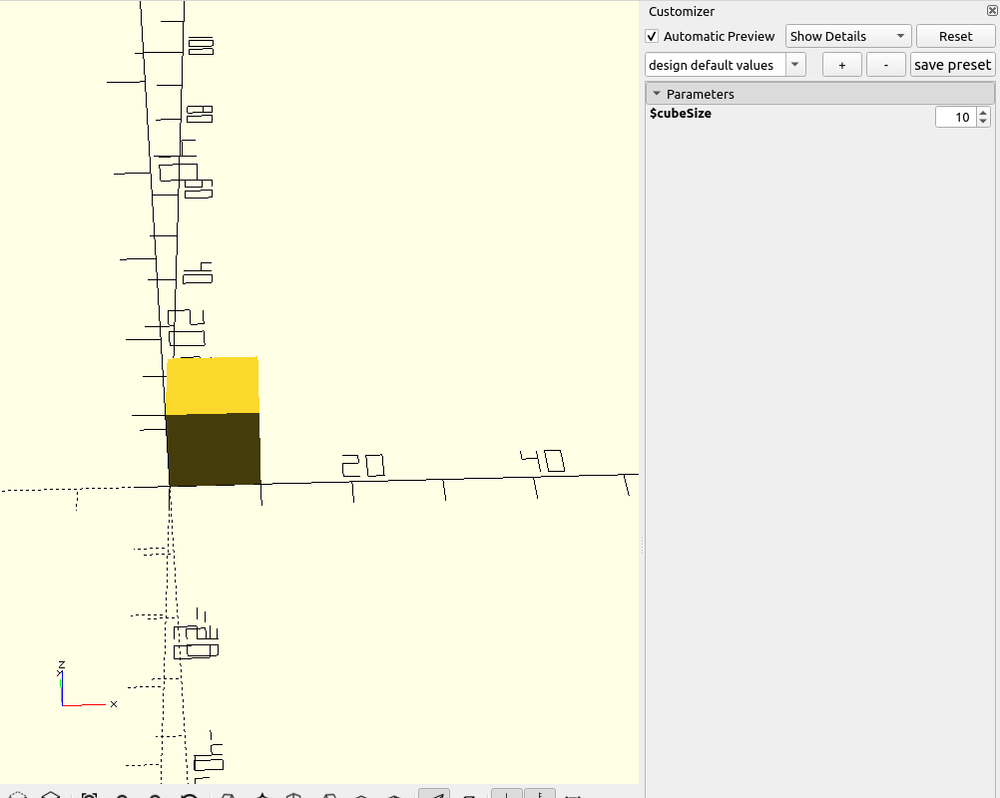
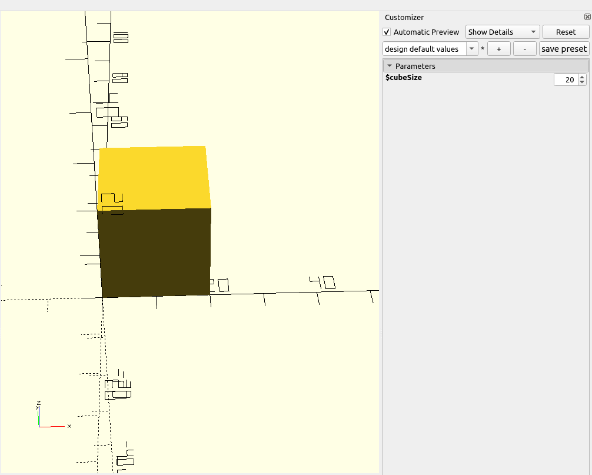
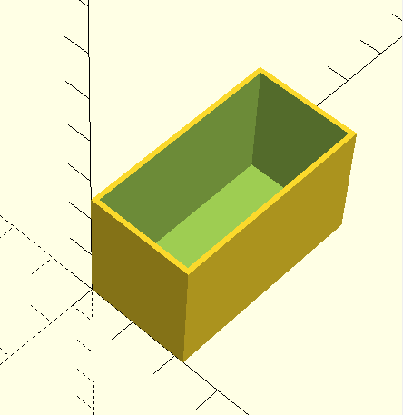

# Creating shapes in PhpScad

All shapes need to implement the [`Renderable`](../src/Primitive/Renderable.php) interface.

Note that there are many [traits](../src/Implementation) that can help you with common tasks.

## Available traits

- `AliasShape` - if you want your shape to be defined as an alias to a different shape
- `ConditionalRenderable` - allows you to render the shape only if a condition is met
- `FacetsConfigImplementation` - used in conjunction with `HasFacetsConfig` interface, provides an implementation for
the required methods
- `GetWrappedRenderable` - provides a method that gets the renderable wrapped in any potential wrappers (more on wrappers in a separate documentation)
- `RenderableImplementation` - provides a default implementation of common methods defined in `Renderable` interface
- `ValueConverter` - provides a method to easily convert between php primitives and PhpScad value types (more below)
- `Wither` - provides a helper method `with()` for easily creating immutable objects
- `WrapperModuleDefinitions` - an implementation for wrapper modules (more in a separate documentation)
- `WrapperRenderableImplementation` - an implementation for wrapper modules (more in a separate documentation)

## Implementing raw shapes

Raw shapes work by directly providing OpenSCAD instructions.
As all basic shapes are already implemented, let's reimplement cube, step by step.

Cube takes three parameters: width, depth and height.

```php
<?php

final class Cube
{
    public function __construct(
        private readonly float $width,
        private readonly float $depth,
        private readonly float $height,
    ) {}
}
```

As mentioned, it needs to implement the `Renderable` interface, let's do so!
Let's also use the `RenderableImplementation` trait to avoid implementing common stuff, like position and color.

```php
<?php

use Rikudou\PhpScad\Implementation\RenderableImplementation;
use Rikudou\PhpScad\Primitive\Renderable;

final class Cube implements Renderable
{
    use RenderableImplementation;

    public function __construct(
        private readonly float $width,
        private readonly float $depth,
        private readonly float $height,
    ) {}

    public function render(): string
    {
        // TODO: Implement render() method.
    }
}
```

The `[cube](https://en.wikibooks.org/wiki/OpenSCAD_User_Manual/Primitive_Solids#cube)` documentation in OpenSCAD
is simple enough — it takes either one parameter, which is the size of each side, or three parameters in an array
which are the same as our three parameters — width, depth and height.

So the `render()` method can simply be implemented as such:

```php
<?php

use Rikudou\PhpScad\Implementation\RenderableImplementation;
use Rikudou\PhpScad\Primitive\Renderable;

final class Cube implements Renderable
{
    use RenderableImplementation;

    public function __construct(
        private readonly float $width,
        private readonly float $depth,
        private readonly float $height,
    ) {}

    public function render(): string
    {
        return "cube([{$this->width}, {$this->depth}, {$this->height}]);";
    }
}
```

And that's it — now you can use it (almost) like any other `Renderable`.

Why almost?
There's a concept of wrappers in PhpScad where shapes can specify what they're wrapped by.
All built-in shapes can be wrapped by a color change wrapper and a position change wrapper.
To make use of them our class needs to implement one more interface, `HasWrappers`:

```php
<?php

use Rikudou\PhpScad\Implementation\RenderableImplementation;
use Rikudou\PhpScad\Primitive\HasWrappers;
use Rikudou\PhpScad\Primitive\Renderable;

final class Cube implements Renderable, HasWrappers
{
    use RenderableImplementation;

    public function __construct(
        private readonly float $width,
        private readonly float $depth,
        private readonly float $height,
    ) {}

    public function render(): string
    {
        return "cube([{$this->width}, {$this->depth}, {$this->height}]);";
    }
}
```

Thanks to the `RenderableImplementation` we don't need to implement any methods as it already implements them.
Thanks to `HasWrappers` we can now use convenience methods like so:

```php
<?php

use Rikudou\PhpScad\Coordinate\XYZ;

$cube = (new Cube(1, 2, 3))
    ->movedBy(new XYZ(1, 2, 3)); // this method is provided by RenderableImplementation, but more importantly, it works
                                 // because the class implements HasWrappers interface
```

We could be done with this and it would be perfectly workable unless we want to use the OpenSCAD customizer which
allows you to define fully parametric SCAD models.

Before we can do so, let's learn about the PhpScad value types.

## Value types

All built-in shapes accept not only primitive values (floats, strings) but also the corresponding PhpScad value type:

- primitive literals (all extend the `Literal` value class)
  - `BoolValue`
  - `FloatValue`
  - `IntValue`
  - `NullValue`
  - `NumericValue` - parent of `FloatValue` and `IntValue`, useful if you want to accept both
  - `StringValue`
  - `VectorValue` - a one dimensional array
- special value types
  - `Autoscale` - a special value type used in the `Resize` renderable
  - `Face` - used in polyhedrons
  - `FaceVector` - a vector of `Face`s, used in polyhedrons
  - `Point` - a point used in polyhedrons
  - `PointVector` - a vector of `Point`s, used in polyhedrons
- runtime references (all extend the `Reference` value class)
  - `Variable` - a reference to OpenSCAD variable
  - `Expression` - an expression evaluated at runtime

The special value types don't interest us in our cube module, so let's skip those. What interests us are these

- `IntValue`
- `FloatValue`
- `NumericValue`
- `Variable`
- `Expression`

Or more specifically to avoid duplication:

- `NumericValue` (parent of `IntValue` and `FloatValue`)
- `Reference` (parent of `Variable` and `Expression`)

So let's update our class!

```php
<?php

use Rikudou\PhpScad\Implementation\RenderableImplementation;
use Rikudou\PhpScad\Primitive\HasWrappers;
use Rikudou\PhpScad\Primitive\Renderable;
use Rikudou\PhpScad\Value\NumericValue;
use Rikudou\PhpScad\Value\Reference;

final class Cube implements Renderable, HasWrappers
{
    use RenderableImplementation;

    public function __construct(
        private readonly NumericValue|Reference|float $width,
        private readonly NumericValue|Reference|float $depth,
        private readonly NumericValue|Reference|float $height,
    ) {
    }

    public function render(): string
    {
        return "cube([{$this->width}, {$this->depth}, {$this->height}]);";
    }
}
```

And that's it!
We only changed which types we accept, and everything works
(all PhpScad value types implement the `Stringable` interface - they are converted to string automatically).

And just like that we added support for runtime variables and expressions:

```php

use Rikudou\PhpScad\ScadModel;
use Rikudou\PhpScad\Customizer\IntCustomizerVariable;
use Rikudou\PhpScad\Value\Variable;

$model = (new ScadModel())
    // define a customizer variable called `$cubeSize`
    ->withVariable(new IntCustomizerVariable('cubeSize', 10))
    // instead of providing the value as a literal, we use a runtime variable
    ->withRenderable(new Cube(new Variable('cubeSize'), new Variable('cubeSize'), new Variable('cubeSize')))
 ;

```

And this is how it looks like in the customizer:




### Runtime expressions

Now let's imagine we want to make our module create a cube that's 1 mm larger than the parameters we have been provided.

Easy enough with only primitive types:

```php
    public function render(): string
    {
        $width = $this->width + 1;
        $depth = $this->depth + 1;
        $height = $this->height + 1;
        return "cube([{$width}, {$depth}, {$height}]);";
    }
```

A little more verbose, but equally easy with `NumericValue`:

```php
    public function render(): string
    {
        $width = new FloatValue($this->width->getValue() + 1);
        $depth = new FloatValue($this->depth->getValue() + 1);
        $height = new FloatValue($this->height->getValue() + 1);
        return "cube([{$width}, {$depth}, {$height}]);";
    }
```

When you have reference types, it gets complicated because you cannot do calculations with something that is a reference
that will be only populated when rendering.
That's what the `Expression` reference value is for:

```php
<?php

use Rikudou\PhpScad\Implementation\RenderableImplementation;
use Rikudou\PhpScad\Primitive\HasWrappers;
use Rikudou\PhpScad\Primitive\Renderable;
use Rikudou\PhpScad\Value\Expression;
use Rikudou\PhpScad\Value\NumericValue;
use Rikudou\PhpScad\Value\Reference;

final class Cube implements Renderable, HasWrappers
{
    use RenderableImplementation;

    public function __construct(
        private readonly NumericValue|Reference|float $width,
        private readonly NumericValue|Reference|float $depth,
        private readonly NumericValue|Reference|float $height,
    ) {
    }

    public function render(): string
    {
        // remember that all value types (as well as float primitives) can be converted to a string
        
        // so here we're writing the addition expression literally, if we get a literal value (float or NumericValue)
        // it will be rendered as "3 + 1" (assuming "3" is the literal value we got)
        
        // if we get a Variable value, it will be written as "$test + 1" (assuming "test" is the name of the variable)
        
        // if we get an Expression, it will be written as "(2 + 1) + 1" (assuming "2 + 1" is the expression we received)
        $width = new Expression("{$this->width} + 1");
        $depth = new Expression("{$this->depth} + 1");
        $height = new Expression("{$this->height} + 1");

        return "cube([{$width}, {$depth}, {$height}]);";
    }
}
```

#### Final touches

This is not a requirement but it's something I like to do because it makes the resulting OpenSCAD code smaller.

Instead of always returning an expression,
return a literal value if you're working with literals and only return expressions if you're working with references:

```php
<?php

use Rikudou\PhpScad\Implementation\RenderableImplementation;
use Rikudou\PhpScad\Implementation\ValueConverter;
use Rikudou\PhpScad\Primitive\HasWrappers;
use Rikudou\PhpScad\Primitive\Renderable;
use Rikudou\PhpScad\Value\Expression;
use Rikudou\PhpScad\Value\FloatValue;
use Rikudou\PhpScad\Value\Literal;
use Rikudou\PhpScad\Value\NumericValue;
use Rikudou\PhpScad\Value\Reference;

final class Cube implements Renderable, HasWrappers
{
    use RenderableImplementation;
    use ValueConverter; // this adds the trait that allows for easy conversion from primitive types to PhpScad value types

    public function __construct(
        private readonly NumericValue|Reference|float $width,
        private readonly NumericValue|Reference|float $depth,
        private readonly NumericValue|Reference|float $height,
    ) {
    }

    public function render(): string
    {
        // first convert it all to a PhpScad value type so that we're not trying to work with both
        // floats and Value objects
        // the convertToValue() method converts raw types (floats in this case) to their corresponding value types
        // (FloatValue) and leaves instances of Value types (NumericValue, Reference in this case) without changing them
        $width = $this->convertToValue($this->width);
        $depth = $this->convertToValue($this->depth);
        $height = $this->convertToValue($this->height);

        // check if we're dealing with a reference, if so, the only way forward is using an expression
        // if not, we can calculate the target value directly in php and make the resulting OpenSCAD code smaller
        $width = $width instanceof Reference
            ? new Expression("{$width} + 1")
            : new FloatValue($width->getValue() + 1);
        $depth = $depth instanceof Reference
            ? new Expression("{$depth} + 1")
            : new FloatValue($depth->getValue() + 1);
        // you can also check for Literal instead of Reference
        $height = $height instanceof Literal
            ? new FloatValue($height->getValue() + 1)
            : new Expression("{$height} + 1");

        return "cube([{$width}, {$depth}, {$height}]);";
    }
}
```

## Alias types

The above was for creating shapes directly using an OpenSCAD expression.
While you can always do so, it might be a better idea to make use of existing shapes, let's take a simple example
of a `RegularCube`:

```php
<?php

use Rikudou\PhpScad\Primitive\HasWrappers;
use Rikudou\PhpScad\Primitive\Renderable;
use Rikudou\PhpScad\Value\NumericValue;
use Rikudou\PhpScad\Value\Reference;

final class RegularCube implements Renderable, HasWrappers
{
    public function __construct(
        private readonly NumericValue|Reference|float $size,
    ) {
    }
}
```

> Here we're taking into account everything we've learned so far - implementing `HasWrappers` and accepting `Value` types
> in addition to primitive values.

Instead of writing the `render()` method directly, we will use a trait called `AliasShape`:

```php
<?php

use Rikudou\PhpScad\Implementation\AliasShape;
use Rikudou\PhpScad\Primitive\HasWrappers;
use Rikudou\PhpScad\Primitive\Renderable;
use Rikudou\PhpScad\Value\NumericValue;
use Rikudou\PhpScad\Value\Reference;

final class RegularCube implements Renderable, HasWrappers
{
    use AliasShape;

    public function __construct(
        private readonly NumericValue|Reference|float $size,
    ) {
    }

    protected function getAliasedShape(): Renderable
    {
        // TODO: Implement getAliasedShape() method.
    }
}
```

The implementation is dead simple, you just return a cube!

```php
<?php

use Rikudou\PhpScad\Implementation\AliasShape;
use Rikudou\PhpScad\Primitive\HasWrappers;
use Rikudou\PhpScad\Primitive\Renderable;
use Rikudou\PhpScad\Shape\Cube;
use Rikudou\PhpScad\Value\NumericValue;
use Rikudou\PhpScad\Value\Reference;

final class RegularCube implements Renderable, HasWrappers
{
    use AliasShape;

    public function __construct(
        private readonly NumericValue|Reference|float $size,
    ) {
    }

    protected function getAliasedShape(): Renderable
    {
        return new Cube($this->size, $this->size, $this->size);
    }
}
```

We're almost done here - remember when I've explained wrappers (position, color)? In an aliased shape you might need
to also resolve all wrappers, luckily there's a helper for that:

```php
<?php

use Rikudou\PhpScad\Implementation\AliasShape;
use Rikudou\PhpScad\Implementation\GetWrappedRenderable;
use Rikudou\PhpScad\Primitive\HasWrappers;
use Rikudou\PhpScad\Primitive\Renderable;
use Rikudou\PhpScad\Shape\Cube;
use Rikudou\PhpScad\Value\NumericValue;
use Rikudou\PhpScad\Value\Reference;

final class RegularCube implements Renderable, HasWrappers
{
    use AliasShape;
    use GetWrappedRenderable;

    public function __construct(
        private readonly NumericValue|Reference|float $size,
    ) {
    }

    protected function getAliasedShape(): Renderable
    {
        return $this->getWrapped(new Cube($this->size, $this->size, $this->size));
    }
}
```

> In the example above you wouldn't have actually needed to call the `getWrapped()` method as it's done automatically
> for the top-level aliased shape, but in a nested shape you would have to do it yourself

## Complex example

Let's make a room model! It will be a simple room with no windows or doors, just floor and four walls.

What parameters do we need?

- `width` - the width of the inside of our room
- `depth` - the depth of the inside of our room
- `height` - the height of the inside of our room
- `wallWidth` - the width of a single wall
- `floorHeight` - the height of the floor

All of those are gonna be numeric types:

```php
<?php

use Rikudou\PhpScad\Implementation\ValueConverter;
use Rikudou\PhpScad\Primitive\HasWrappers;
use Rikudou\PhpScad\Primitive\Renderable;
use Rikudou\PhpScad\Value\NumericValue;
use Rikudou\PhpScad\Value\Reference;

final class Room implements Renderable, HasWrappers
{
    use ValueConverter;

    private NumericValue|Reference $width;
    private NumericValue|Reference $depth;
    private NumericValue|Reference $wallWidth;
    private NumericValue|Reference $height;
    private NumericValue|Reference $floorHeight;

    public function __construct(
        NumericValue|Reference|float $width,
        NumericValue|Reference|float $depth,
        NumericValue|Reference|float $wallWidth = 1,
        NumericValue|Reference|float $floorHeight = 0.2,
        NumericValue|Reference|float $height = 25,
    ) {
        $this->width = $this->convertToValue($width);
        $this->depth = $this->convertToValue($depth);
        $this->wallWidth = $this->convertToValue($wallWidth);
        $this->height = $this->convertToValue($height);
        $this->floorHeight = $this->convertToValue($floorHeight);
    }
}
```

We directly convert the constructor values to the `Value` types to avoid having to check for floats. I also provided
some default values for wall width, floor height and height, those are likely to remain the same across different rooms
while width and depth will change.

Instead of creating our shape directly as OpenSCAD instructions, we'll be aliasing it to an existing renderable called
`Difference` - it takes arbitrary number of `Renderable` objects and subtracts the shapes from each other.

```php
<?php

use Rikudou\PhpScad\Combination\Difference;
use Rikudou\PhpScad\Coordinate\XYZ;
use Rikudou\PhpScad\Implementation\AliasShape;
use Rikudou\PhpScad\Implementation\ValueConverter;
use Rikudou\PhpScad\Primitive\HasWrappers;
use Rikudou\PhpScad\Primitive\Renderable;
use Rikudou\PhpScad\Shape\Cube;
use Rikudou\PhpScad\Value\Expression;
use Rikudou\PhpScad\Value\FloatValue;
use Rikudou\PhpScad\Value\NumericValue;
use Rikudou\PhpScad\Value\Reference;

final class Room implements Renderable, HasWrappers
{
    use AliasShape;
    use ValueConverter;

    private NumericValue|Reference $width;
    private NumericValue|Reference $depth;
    private NumericValue|Reference $wallWidth;
    private NumericValue|Reference $height;
    private NumericValue|Reference $floorHeight;

    public function __construct(
        NumericValue|Reference|float $width,
        NumericValue|Reference|float $depth,
        NumericValue|Reference|float $wallWidth = 1,
        NumericValue|Reference|float $floorHeight = 0.2,
        NumericValue|Reference|float $height = 25,
    ) {
        $this->width = $this->convertToValue($width);
        $this->depth = $this->convertToValue($depth);
        $this->wallWidth = $this->convertToValue($wallWidth);
        $this->height = $this->convertToValue($height);
        $this->floorHeight = $this->convertToValue($floorHeight);
    }

    protected function getAliasedShape(): Renderable
    {
        // this is the width and depth of the outer cube, it has to include two walls on all sides
        $outerCubeWidth = $this->width instanceof Reference || $this->wallWidth instanceof Reference
            ? new Expression("{$this->width} + {$this->wallWidth} * 2")
            : new FloatValue($this->width->getValue() + $this->wallWidth->getValue() * 2);
        $outerCubeDepth = $this->depth instanceof Reference || $this->wallWidth instanceof Reference
            ? new Expression("{$this->depth} + {$this->wallWidth} * 2")
            : new FloatValue($this->depth->getValue() + $this->wallWidth->getValue() * 2);
        // the height of the outer cube is our floor height plus the provided height
        $outerCubeHeight = $this->height instanceof Reference || $this->floorHeight instanceof Reference
            ? new Expression("{$this->height} + {$this->floorHeight}")
            : new FloatValue($this->height->getValue() + $this->floorHeight->getValue());

        $outerCube = new Cube($outerCubeWidth, $outerCubeDepth, $outerCubeHeight);

        // the inner cube has the provided dimensions, but we do one trick you need to do when two overlapping objects
        // have the exact same dimension - add a very small value to it to ensure that one is greater than the other
        // otherwise you get weird flickering issues and the rendering might not work out the way you want to
        $innerCube = new Cube(
            $this->width,
            $this->depth,
            $this->height instanceof Reference
                ? new Expression("{$this->height} + 0.01")
                : new FloatValue($this->height->getValue() + 0.01),
        );

        // both inner cube and outer cube would render at the same coordinate by default, you need to move the inner
        // cube a bit to create the walls and floor
        $innerCube = $innerCube->movedBy(new XYZ(
            x: $this->wallWidth,
            y: $this->wallWidth,
            z: $this->floorHeight,
        ));

        // this will subtract the two objects, basically creating a hollow space where the two objects overlap,
        // meaning the inner cube will actually create an empty space in the middle of the room
        return new Difference($outerCube, $innerCube);
    }
}
```

When we render using this code:

```php
<?php

use Rikudou\PhpScad\ScadModel;

$model = (new ScadModel())
    ->withRenderable(new Room(
        width: 20,
        depth: 40,
    ));
$model->render(__DIR__ . '/output.scad');
```

We get this result:

```openscad
module __Customizer_End() {}
difference() {cube([22, 42, 25.2]);translate([1, 1, 0.2]) {cube([20, 40, 25.01]);}}
```

And more importantly this model:


