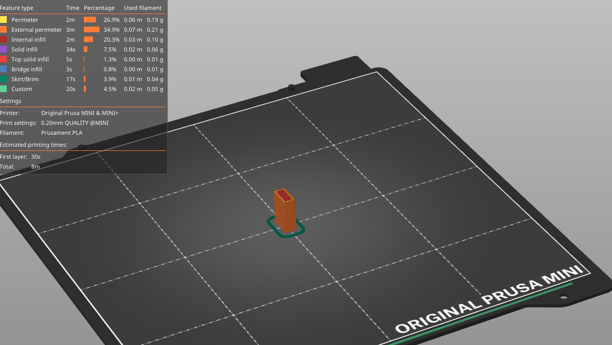

# Creating a custom renderer

What is a renderer? It transforms the `ScadModel` object, which houses all the defined `Renderable` objects, into
something usable outside of this library.
The built-in examples include a SCAD file (for opening in OpenSCAD), a PNG file with model preview and an STL model
file for using with 3D viewers, slicers and so on.

Today we're going to create a renderer that creates a GCode for 3D printers directly.

## Prerequisites

We'll need `PrusaSlicer` and `OpenSCAD` installed on our system. It can either be installed locally or from flatpak.

On Ubuntu, you can install by using `apt install prusa-slicer openscad`. If your system supports flatpaks install using
`flatpak install com.prusa3d.PrusaSlicer org.openscad.OpenSCAD`.

## Creating a renderer

Creating a renderer starts by creating a class implementing the `Renderer` interface:

```php
<?php

namespace Rikudou\PhpScad\Renderer;

final class GCodeRenderer implements Renderer
{
    public function render(string $outputFile, string $scadContent): void
    {
        // TODO: Implement render() method.
    }
}
```

As you can see, the `Renderer` defines a single method `render()` which accepts the output file path as a parameter
and the SCAD content.

### Flow

We're going to take the `$scadContent` and let the built-in `StlRenderer` convert it into a STL 3D model,
then we're going to take the STL file and slice it using PrusaSlicer into GCode.

We'll be making it as easy to use as possible, which means we'll try to find where PrusaSlicer and OpenSCAD is located
but we'll also need to provide some way to use a custom path:

```php
<?php

namespace Rikudou\PhpScad\Renderer;

final class GCodeRenderer implements Renderer
{
    public function __construct(
        ?string $prusaSlicerPath = null,
        private readonly StlRenderer $stlRenderer = new StlRenderer(),
    ) {
    }

    public function render(string $outputFile, string $scadContent): void
    {
        // TODO: Implement render() method.
    }
}
```

We allow providing of custom PrusaSlicer and custom `StlRenderer` instance which could have a manual path set.
The STL renderer has its own logic (which we'll be pretty much replicating for PrusaSlicer in our class)
for locating OpenSCAD, so we can skip writing code for that part in our code.

We'll be checking in constructor that we can find a path if we're not provided one:

```php
<?php

namespace Rikudou\PhpScad\Renderer;

final class GCodeRenderer implements Renderer
{
    private string $prusaSlicerPath;

    public function __construct(
        ?string $prusaSlicerPath = null,
        private readonly StlRenderer $stlRenderer = new StlRenderer(),
    ) {
        $this->prusaSlicerPath = $prusaSlicerPath ?? $this->locatePrusaSlicer();
    }

    // ...

    private function locatePrusaSlicer(): string
    {
        // TODO: find the binary or throw an exception
    }
}
```

For locating the binary I'm pretty much just going to copy & paste from the `AbstractOpenScadBinaryRenderer` library:

```php
<?php

namespace Rikudou\PhpScad\Renderer;

use RuntimeException;

final class GCodeRenderer implements Renderer
{
    private string $prusaSlicerPath;

    public function __construct(
        ?string $prusaSlicerPath = null,
        private readonly StlRenderer $stlRenderer = new StlRenderer(),
    ) {
        $this->prusaSlicerPath = $prusaSlicerPath ?? $this->locatePrusaSlicer();
    }

    // ...

    private function locatePrusaSlicer(): string
    {
        // try finding the binary in $PATH
        exec('which prusa-slicer', $output, $exitCode);
        if ($exitCode === 0) { // in Unix, 0 means success
            return "'{$output[0]}'"; // the path might contain a space, enclose it in a single quote
        }

        $exception = new RuntimeException('Cannot find PrusaSlicer in path.');

        exec('which flatpak', result_code: $exitCode);
        if ($exitCode !== 0) { // if flatpak doesn't exist, no need to check further
            throw $exception;
        }

        // if the flatpak is not installed, throw an exception
        exec('flatpak info com.prusa3d.PrusaSlicer', result_code: $exitCode);
        if ($exitCode !== 0) {
            throw $exception;
        }

        // we will need the --file-forwarding flag if we want the Slicer to have access to the files we'll be creating
        return 'flatpak run --file-forwarding com.prusa3d.PrusaSlicer';
    }

    private function isFlatpak(): bool
    {
        return str_starts_with($this->prusaSlicerPath, 'flatpak ');
    }
}
```

Let's also add one helper method:

```php
<?php

namespace Rikudou\PhpScad\Renderer;

use RuntimeException;

final class GCodeRenderer implements Renderer
{
    /**
     * @var array<string>
     */
    private array $temporaryFiles = [];

    // ...
    
    public function __destruct()
    {
        foreach ($this->temporaryFiles as $temporaryFile) {
            if (is_file($temporaryFile)) {
                unlink($temporaryFile);
            }
        }
    }

    private function createTemporaryStlFile(): string
    {
        $file = tempnam(sys_get_temp_dir(), 'PhpScadGCodeRenderer');
        rename($file, "{$file}.stl");
        $this->temporaryFiles[] = $file;

        return "{$file}.stl";
    }
}
```

This will help us create temporary files which will be automatically deleted when our script ends.

Now let's get started by creating the STL file as a temporary file:

```php
    public function render(string $outputFile, string $scadContent): void
    {
        $stlFile = $this->createTemporaryStlFile();
        $this->stlRenderer->render($stlFile, $scadContent);
    }
```

And let's construct and execute the command:

```php
    public function render(string $outputFile, string $scadContent): void
    {
        $stlFile = $this->createTemporaryStlFile();
        $this->stlRenderer->render($stlFile, $scadContent);

        // we specify that we want to export a gcode
        $command = "{$this->prusaSlicerPath} --gcode -o ";
        // in previous part you can see '-o' which means output file, we need to check whether we're running a flatpak
        // or not to give the correct path
        if ($this->isFlatpak()) {
            // this is a special syntax that tells the flatpak system to forward real filesystem files to the app
            $command .= "@@ '{$outputFile}' @@";
        } else {
            $command .= "'{$outputFile}'";
        }
        $command .= ' ';
        // we do the same for input file
        if ($this->isFlatpak()) {
            $command .= "@@ '{$stlFile}' @@";
        } else {
            $command .= "'{$stlFile}'";
        }
        // this tells the shell that error output should be redirected to standard output
        $command .= " 2>&1";
        
        exec($command, $output, result_code: $exitCode);
        if ($exitCode !== 0) {
            throw new RuntimeException('There was an error while slicing your model: ' . implode("\n", $output));
        }
    }
```

This is the simplest form of the command and isn't actually that great because the sliced GCode will probably be wrong
regardless of what printer you use.

To mitigate that let's add support for loading custom options! PrusaSlicer accepts an ini file with configurations
(which you can export from the GUI by going to `File -> Export -> Export config` or pressing `CTRL+E`) and we'll
add a parameter that allows us to load such a config file!

> You could also add support for the hundreds of individual parameters, but that would be way too out of scope of this
> tutorial.

```php
<?php

namespace Rikudou\PhpScad\Renderer;

use RuntimeException;

final class GCodeRenderer implements Renderer
{
    /**
     * @var array<string>
     */
    private array $temporaryFiles = [];
    private string $prusaSlicerPath;

    public function __construct(
        private readonly ?string $configFile = null,
        ?string $prusaSlicerPath = null,
        private readonly StlRenderer $stlRenderer = new StlRenderer(),
    ) {
        $this->prusaSlicerPath = $prusaSlicerPath ?? $this->locatePrusaSlicer();
    }
    
    // ...

    public function render(string $outputFile, string $scadContent): void
    {
        $stlFile = $this->createTemporaryStlFile();
        $this->stlRenderer->render($stlFile, $scadContent);

        // we specify that we want to export a gcode
        $command = "{$this->prusaSlicerPath} --gcode -o ";
        // in previous part you can see '-o' which means output file, we need to check whether we're running a flatpak
        // or not to give the correct path
        if ($this->isFlatpak()) {
            // this is a special syntax that tells the flatpak system to forward real filesystem files to the app
            $command .= "@@ '{$outputFile}' @@";
        } else {
            $command .= "'{$outputFile}'";
        }
        $command .= ' ';
        // we do the same for input file
        if ($this->isFlatpak()) {
            $command .= "@@ '{$stlFile}' @@";
        } else {
            $command .= "'{$stlFile}'";
        }
        if ($this->configFile) {
            $command .= " --load ";
            if ($this->isFlatpak()) {
                $command .= "@@ '{$this->configFile}' @@";
            } else {
                $command .= "'{$this->configFile}'";
            }
        }
        // this tells the shell that error output should be redirected to standard output
        $command .= " 2>&1";

        exec($command, $output, result_code: $exitCode);
        if ($exitCode !== 0) {
            throw new RuntimeException('There was an error while slicing your model: ' . implode("\n", $output));
        }
    }
    
    // ...
}
```

The whole command then might look something like this:

`flatpak run --file-forwarding com.prusa3d.PrusaSlicer --gcode -o @@ '/home/user/PhpScad/output.gcode' @@ @@ '/tmp/PhpScadGCodeRendererdafabR.stl' @@ --load @@ '/home/user/PhpScad/doc/prusa-mini.ini' @@ 2>&1`

You can check the [example config file](prusa-mini.ini) to see what it looks like.

Now let's try it!

```php
<?php

use Rikudou\PhpScad\FacetsConfiguration\FacetsNumber;
use Rikudou\PhpScad\Renderer\GCodeRenderer;
use Rikudou\PhpScad\ScadModel;
use Rikudou\PhpScad\Shape\Cube;

require __DIR__ . '/vendor/autoload.php';

(new ScadModel(facetsConfiguration: new FacetsNumber(60)))
    ->withRenderable(
        new Cube(5, 10, 15),
    )
    ->withRenderer(new GCodeRenderer(configFile: __DIR__ . '/prusa-mini.ini'))
    ->render(__DIR__ . '/output.gcode');

```

And sure enough, the generated gcode looks good!



Just in case, this is the whole class:

```php
<?php

namespace Rikudou\PhpScad\Renderer;

use RuntimeException;

final class GCodeRenderer implements Renderer
{
    /**
     * @var array<string>
     */
    private array $temporaryFiles = [];
    private string $prusaSlicerPath;

    public function __construct(
        private readonly ?string $configFile = null,
        ?string $prusaSlicerPath = null,
        private readonly StlRenderer $stlRenderer = new StlRenderer(),
    ) {
        $this->prusaSlicerPath = $prusaSlicerPath ?? $this->locatePrusaSlicer();
    }

    public function __destruct()
    {
        foreach ($this->temporaryFiles as $temporaryFile) {
            if (is_file($temporaryFile)) {
                unlink($temporaryFile);
            }
        }
    }

    public function render(string $outputFile, string $scadContent): void
    {
        $stlFile = $this->createTemporaryStlFile();
        $this->stlRenderer->render($stlFile, $scadContent);

        // we specify that we want to export a gcode
        $command = "{$this->prusaSlicerPath} --gcode -o ";
        // in previous part you can see '-o' which means output file, we need to check whether we're running a flatpak
        // or not to give the correct path
        if ($this->isFlatpak()) {
            // this is a special syntax that tells the flatpak system to forward real filesystem files to the app
            $command .= "@@ '{$outputFile}' @@";
        } else {
            $command .= "'{$outputFile}'";
        }
        $command .= ' ';
        // we do the same for input file
        if ($this->isFlatpak()) {
            $command .= "@@ '{$stlFile}' @@";
        } else {
            $command .= "'{$stlFile}'";
        }
        if ($this->configFile) {
            $command .= " --load ";
            if ($this->isFlatpak()) {
                $command .= "@@ '{$this->configFile}' @@";
            } else {
                $command .= "'{$this->configFile}'";
            }
        }
        // this tells the shell that error output should be redirected to standard output
        $command .= " 2>&1";

        exec($command, $output, result_code: $exitCode);
        if ($exitCode !== 0) {
            throw new RuntimeException('There was an error while slicing your model: ' . implode("\n", $output));
        }
    }

    private function locatePrusaSlicer(): string
    {
        // try finding the binary in $PATH
        exec('which prusa-slicer', $output, $exitCode);
        if ($exitCode === 0) { // in Unix, 0 means success
            return "'{$output[0]}'"; // the path might contain a space, enclose it in a single quote
        }

        $exception = new RuntimeException('Cannot find PrusaSlicer in path.');

        exec('which flatpak', result_code: $exitCode);
        if ($exitCode !== 0) { // if flatpak doesn't exist, no need to check further
            throw $exception;
        }

        // if the flatpak is not installed, throw an exception
        exec('flatpak info com.prusa3d.PrusaSlicer', result_code: $exitCode);
        if ($exitCode !== 0) {
            throw $exception;
        }

        // we will need the --file-forwarding flag if we want the Slicer to have access to the files we'll be creating
        return 'flatpak run --file-forwarding com.prusa3d.PrusaSlicer';
    }

    private function isFlatpak(): bool
    {
        return str_starts_with($this->prusaSlicerPath, 'flatpak ');
    }

    private function createTemporaryStlFile(): string
    {
        $file = tempnam(sys_get_temp_dir(), 'PhpScadGCodeRenderer');
        rename($file, "{$file}.stl");
        $this->temporaryFiles[] = $file;

        return "{$file}.stl";
    }
}
```
